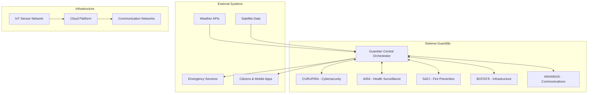
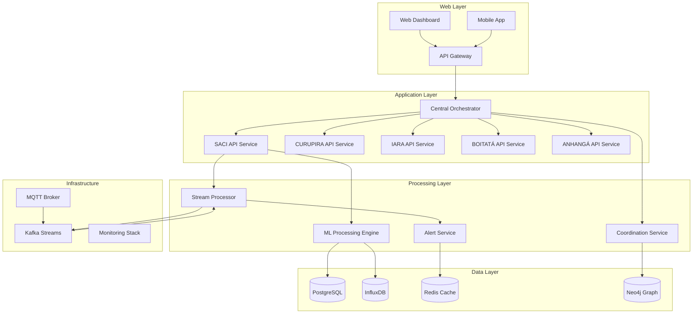
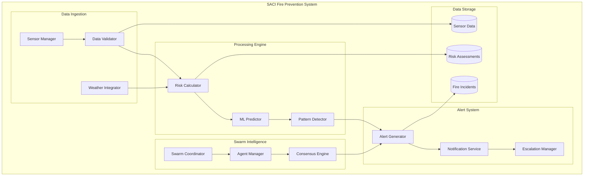

# SISTEMA GUARDIÃO - MASTER DOCUMENTATION

## Plataforma Nacional Integrada de Prevenção e Resposta a Eventos Extremos

**Status:** Em Desenvolvimento (Global Solution FIAP 2025.1 - Sprint de 10 Dias)  
**Repositório:** [https://github.com/YanCotta/global_solution_1_fiap](https://github.com/YanCotta/global_solution_1_fiap)  
**Equipe:** Yan Cotta  
**Data de Criação:** Maio 2025  
**Versão:** 2.0 - Documentação Consolidada  

---

## 🎯 SUMÁRIO EXECUTIVO EXPANDIDO

O **Sistema Guardião** transcende a gestão de crises tradicional, estabelecendo-se como uma **plataforma nacional de inteligência simbiótica**, onde a mais avançada **Inteligência Artificial agêntica** se entrelaça com a **sabedoria ancestral do folclore brasileiro**. Esta fusão não é meramente nominal; ela inspira a arquitetura de agentes autônomos especializados (os "Guardiões Digitais"), cada um ecoando as características protetoras de suas contrapartes lendárias. O sistema é projetado com um **foco dual e indissociável**: por um lado, a **prevenção proativa**, antecipando e mitigando ameaças antes de sua materialização; por outro, a **resposta ágil e coordenada**, orquestrando recursos de forma otimizada quando eventos extremos ocorrem.

A **inovação central** reside na aplicação de **IA agêntica em escala nacional para infraestruturas críticas**. Diferentemente de sistemas centralizados e monolíticos, o Guardião opera como um ecossistema de agentes inteligentes e colaborativos. Esta abordagem permite uma **coordenação descentralizada, resiliente e emergente**, capaz de se adaptar dinamicamente a cenários complexos e imprevistos, garantindo a continuidade operacional e a segurança da nação.

### Proposta de Valor Multifacetada

O Sistema Guardião oferece um valor transformador para múltiplos stakeholders:

* **Para o Governo e Órgãos Públicos:**
  * **Segurança Nacional Aprimorada:** Capacidade preditiva e de resposta significativamente elevada contra uma vasta gama de ameaças (naturais, tecnológicas, sanitárias, cibernéticas).
  * **Otimização de Recursos e Redução de Custos:** Alocação inteligente de recursos emergenciais, minimizando desperdícios e maximizando o impacto das intervenções. Redução de custos associados a danos e reconstrução.
  * **Tomada de Decisão Baseada em Dados:** Dashboards e análises avançadas para embasar políticas públicas e estratégias de longo prazo.
  * **Resiliência da Infraestrutura Crítica:** Proteção robusta para setores vitais como energia, água, comunicações, saúde e transportes.

* **Para os Cidadãos:**
  * **Segurança e Bem-Estar Aumentados:** Redução do risco de exposição a desastres e eventos extremos, com sistemas de alerta precoce mais eficazes e personalizados.
  * **Melhoria da Qualidade de Vida:** Minimização de interrupções em serviços essenciais e maior rapidez na recuperação pós-evento.
  * **Confiança e Transparência:** Comunicação clara e acessível sobre riscos e ações de proteção, fortalecendo o elo entre o Estado e a população.

* **Para Empresas e Setor Privado:**
  * **Resiliência Operacional e Continuidade de Negócios:** Proteção de ativos e infraestruturas, minimizando perdas e interrupções de produção.
  * **Novas Oportunidades de Mercado:** Desenvolvimento de soluções e serviços complementares ao ecossistema Guardião.
  * **Redução de Riscos e Prêmios de Seguro:** Mitigação de riscos operacionais e ambientais, potencialmente levando a condições de seguro mais favoráveis.
  * **Dados para Inovação:** Acesso (controlado e anonimizado) a dados e insights para desenvolvimento de novos produtos e serviços.

### Modelo de Negócios & Viabilidade

*(Expandindo sobre "Proposta de Valor Multifacetada" e "Inovação Central: IA Agêntica em Escala Nacional" existentes no MASTER_DOCUMENTATION.md)*

O modelo de negócios do Sistema Guardião baseia-se na criação de valor substancial e mensurável para entidades governamentais e parceiros chave do setor privado, assegurando sua sustentabilidade a longo prazo e importância estratégica para a nação.

#### **Licenciamento Governamental (B2G) - Modelo Software as a Service (SaaS)**

O modelo primário envolve o fornecimento da plataforma Sistema Guardião para órgãos governamentais estaduais e federais através de um acordo de licenciamento estruturado, similar a uma oferta SaaS Governo-para-Governo (G2G) ou Empresa-para-Governo (B2G).

* **Propostas de Valor Chave para Investimento Governamental:**
    * **Segurança Nacional e Pública Aprimorada:** Alinha-se diretamente com a responsabilidade do Estado de proteger cidadãos e infraestruturas críticas, melhorando significativamente as capacidades preditivas e os tempos de resposta a uma vasta gama de eventos extremos (desastres naturais, crises sanitárias, ataques ciberfísicos). Isso se traduz em vidas salvas, ferimentos evitados e redução da perturbação social.
    * **Governança e Formulação de Políticas Baseadas em Dados:** Fornece insights incomparáveis a partir de fontes de dados integradas, permitindo um planejamento urbano mais eficaz, alocação de recursos, formulação de políticas ambientais e estratégias de saúde pública.
    * **Economia e Gestão Otimizada de Recursos:** Reduz o impacto econômico substancial de desastres através de alertas precoces e respostas eficientes e coordenadas. Otimiza a mobilização de serviços de emergência, pessoal e materiais, levando a economias de custos significativas e à prevenção de desperdícios.
    * **Soberania Tecnológica e Inovação:** Estabelece o Brasil como líder na aplicação de IA avançada e IoT para resiliência nacional, fomentando um ecossistema de inovação local e reduzindo a dependência de tecnologias estrangeiras para funções críticas de segurança.
    * **Resiliência Aumentada da Infraestrutura:** Recomendações proativas de monitoramento e manutenção preditiva de subsistemas como BOITATÁ e CURUPIRA minimizam o tempo de inatividade de serviços essenciais (energia, água, comunicações), beneficiando diretamente a economia e o bem-estar público.
    * **Coordenação Interagências Aprimorada:** O GuardianCentralOrchestrator atua como uma plataforma unificada de comando e controle, quebrando silos entre diferentes departamentos governamentais e serviços de emergência.

* **Estrutura do Modelo SaaS para o Governo:**
    * **Acesso por Níveis à Plataforma:** Uma licença de plataforma central fornecendo acesso ao GuardianCentralOrchestrator e capacidades essenciais de integração de dados. Níveis premium ou módulos para subsistemas específicos (SACI, IARA, etc.) ou funcionalidades analíticas avançadas podem ser adicionados com base nas necessidades regionais ou prioridades.
    * **Acordos de Nível de Serviço (SLAs):** SLAs claramente definidos para tempo de atividade da plataforma, velocidades de processamento de dados, tempos de entrega de alertas e tempos de resposta do suporte técnico.
    * **Atualizações Contínuas e Evolução:** Um modelo de assinatura garante que a plataforma receba patches de segurança regulares, atualizações de software, retreinamento/aprimoramentos de modelos de IA e novas funcionalidades desenvolvidas através de P&D contínuo.
    * **Suporte Dedicado e Treinamento:** Fornecimento de equipes de suporte técnico especializado e programas de treinamento abrangentes para o pessoal do governo que opera e utiliza a plataforma.
    * **Serviços de Customização e Integração:** Opções para personalizar dashboards específicos, relatórios analíticos ou integrar com sistemas governamentais legados existentes.
    * **Análise de Dados como Serviço:** Oferta de capacidades avançadas de análise e relatórios sobre os dados coletados (e apropriadamente anonimizados/agregados) para apoiar a tomada de decisão estratégica.

#### **Parcerias Público-Privadas (PPP)**

PPPs estratégicas são vitais para alavancar expertise especializada do setor privado, infraestrutura e inovação, criando um ecossistema simbiótico.

* **Para Empresas de Telecomunicações (Integração com Infraestrutura 5G/Futuras Gerações):**
    * **Benefícios Mútuos:**
        * **Sistema Guardião:** Obtém acesso a redes de comunicação de alta largura de banda, baixa latência e confiáveis, essenciais para a ingestão de dados em tempo real de vastas implementações de sensores IoT e para coordenar respostas rápidas. As telecoms podem fornecer fatiamento de rede (network slicing) priorizado para tráfego crítico do Guardião.
        * **Telecoms:** Oportunidade de exibir e testar capacidades avançadas de 5G/6G e desenvolver novas ofertas de serviços baseados em IoT (ex: soluções de cidades inteligentes, alertas de agricultura de precisão derivados dos dados ambientais do SACI, rastreamento logístico aprimorado para o MULA, com consentimento do usuário). O acesso a dados anonimizados/agregados do Guardião pode auxiliar no planejamento e otimização da rede. Potencial para coinvestimento em infraestrutura de host neutro em áreas subatendidas críticas para a implementação de sensores do Guardião.

* **Para Concessionárias de Serviços Públicos (Energia/Água):**
    * **Valor para as Concessionárias:**
        * **Monitoramento Proativo da Infraestrutura:** O gêmeo digital do BOITATÁ e a segurança ciberfísica do CURUPIRA podem monitorar a infraestrutura crítica das concessionárias, prever falhas potenciais (ex: sobrecargas em subestações, vazamentos em dutos) e identificar vulnerabilidades a ameaças físicas ou cibernéticas.
        * **Distribuição Otimizada de Recursos:** Insights do Guardião podem ajudar as concessionárias a otimizar o balanceamento de carga de energia ou a distribuição de água, especialmente durante crises.
        * **Redução de Custos:** Tempo de inatividade reduzido, agendamento de manutenção preventiva baseado em previsões e resposta mais rápida a incidentes levam a economias de custos operacionais significativas e melhoria da confiabilidade do serviço (minimizando penalidades e danos à reputação).
        * **Segurança Aumentada:** O SACI pode fornecer alertas precoces para riscos de incêndio perto de ativos das concessionárias (ex: linhas de energia em áreas florestais).

* **Para Seguradoras:**
    * **Valor para as Seguradoras:**
        * **Modelagem Avançada de Riscos:** Acesso a análises de risco altamente granulares, em tempo real e preditivas do Guardião (ex: mapas de risco de incêndio do SACI, avaliações de vulnerabilidade de infraestrutura do BOITATÁ, previsões epidemiológicas do IARA, devidamente anonimizadas e agregadas) permite que as seguradoras refinem seus modelos de risco para desastres naturais, falhas de infraestrutura e, potencialmente, até mesmo continuidade de negócios relacionada à saúde.
        * **Ajustes Dinâmicos de Prêmios:** Potencial para desenvolver modelos de prêmios de seguro mais precisos e dinâmicos com base em perfis de risco localizados fornecidos pelo Guardião.
        * **Incentivo a Medidas Preventivas:** As seguradoras podem usar os insights do Guardião para oferecer descontos de prêmio ou incentivos a indivíduos e empresas que adotem medidas preventivas ou tecnologias compatíveis com o Guardião (ex: instalação de sensores de incêndio certificados, reforço de infraestrutura com base nas recomendações do BOITATÁ).
        * **Processamento Mais Rápido de Sinistros:** Dados geoespaciais e relatórios de incidentes do Guardião podem ajudar acelerar a verificação e o processamento de sinistros após um evento.

#### **Fortalecimento do ROI Projetado e Estratégia de Financiamento**

* **Aspectos Qualitativos do ROI:**
    * **Vidas Salvas e Melhores Resultados de Saúde:** O ROI primário e inestimável.
    * **Proteção Ambiental:** Impacto reduzido de incêndios florestais (SACI) na biodiversidade e emissões de carbono; uso otimizado da água (BOITATÁ/IARA); melhor controle da poluição (IARA).
    * **Resiliência Social e Recuperação Mais Rápida:** Interrupção minimizada da vida diária e restauração mais rápida da normalidade pós-evento, reduzindo impactos sociais e psicológicos a longo prazo.
    * **Prestígio Nacional e Soft Power Aprimorados:** Posicionamento do Brasil como um líder global em gestão de desastres e segurança pública tecnologicamente avançada.
    * **Estímulo ao Ecossistema de Inovação:** Criação de um mercado para tecnologias, serviços e empregos qualificados relacionados.

* **Riscos Comuns Associados ao Financiamento de Projetos Tecnológicos Governamentais de Grande Escala:**
    * **Ciclos Políticos & Mudança de Prioridades:** Mudanças no governo podem levar à reavaliação ou desfinanciamento de projetos de longo prazo.
    * **Realocações Orçamentárias:** Fundos públicos estão frequentemente sujeitos a demandas concorrentes e restrições fiscais inesperadas.
    * **Percepção Pública e Adoção:** Falta de compreensão ou confiança na tecnologia pode erodir o apoio público e político.
    * **Complexidade e Atrasos na Execução:** Projetos de grande escala podem enfrentar desafios técnicos imprevistos ou atrasos na implementação, impactando a confiança dos investidores.
    * **Rivalidade Interagências ou Falta de Coordenação:** Garantir o engajamento e a cooperação entre múltiplos departamentos governamentais pode ser desafiador.

* **Estratégias de Mitigação para Riscos de Financiamento:**
    * **Financiamento Faseado Vinculado a Marcos Claros:** Garantir financiamento em tranches, vinculado à entrega bem-sucedida de capacidades e resultados específicos e demonstráveis (ex: piloto bem-sucedido do MVP SACI em Minas Gerais).
    * **Demonstração Antecipada de Benefícios Socioeconômicos:** Priorizar fases iniciais do projeto que entreguem benefícios visíveis e impactantes aos cidadãos e ao governo (ex: alertas de incêndio aprimorados, previsão de inundações melhorada).
    * **Amplo Engajamento das Partes Interessadas e Construção de Coalizões:** Envolver ativamente governos federal, estaduais e municipais, parceiros do setor privado, academia e sociedade civil para construir uma ampla base de apoio.
    * **Governança Transparente e Relatórios Regulares:** Estabelecer uma estrutura de governança clara para o projeto com relatórios regulares e transparentes sobre progresso, despesas e impacto.
    * **Destacar Soberania Tecnológica e Benefícios de Segurança Nacional:** Enfatizar a importância estratégica do sistema para a autonomia e segurança nacional para garantir apoio sustentado de alto nível.
    * **Diversificação das Fontes de Financiamento:** Explorar um mix de dotações orçamentárias federais, contribuições estaduais (para projetos piloto ou implementações de subsistemas específicos), investimentos de PPPs e, potencialmente, subsídios internacionais (ex: para aspectos de adaptação às mudanças climáticas, preparação para pandemias).
    * **Forte Estratégia de Comunicação Pública:** Utilizar o aspecto de integração cultural (nomes do folclore) para construir familiaridade e confiança pública, articulando claramente os benefícios para os cidadãos comuns.

### Inovação Central: IA Agêntica em Escala Nacional

**Coordenação Multi-Agente:** Sistema onde cada subsistema funciona como um agente inteligente autônomo, utilizando princípios de CrewAI (fundada por um brasileiro) e LangGraph para coordenação emergente.

**Valores Únicos de Proposta:**
- **Inteligência Preventiva:** Alertas dias antes de 85% dos eventos catastróficos
- **Prevenção de Cascatas:** Intervenção automatizada antes da propagação de falhas
- **Otimização de Recursos:** Alocação dinâmica reduzindo tempo de resposta em pelo menos 60%
- **Integração Cultural:** Nomenclatura baseada no folclore brasileiro para confiança pública

### Os Cinco Guardiões Digitais

1. **🦶 CURUPIRA** - Centro Unificado de Resposta e Proteção de Infraestruturas Críticas
   * **Missão:** Proteção híbrida físico-digital de infraestruturas críticas
   * **Especialização:** Correlação de ameaças cibernéticas com sensores físicos
   * **IA:** Detector híbrido com redes neurais ensemble

2. **🏥 IARA** - Inteligência Artificial para Resposta e Alerta Epidemiológico
   * **Missão:** Predição precoce de surtos através de monitoramento ambiental
   * **Especialização:** Modelos epidemiológicos adaptativos (SEIR + RL)
   * **IA:** Análise biométrica distribuída e correlação comportamental

3. **🔥 SACI** - Sistema de Alerta e Combate a Incêndios Florestais
   * **Missão:** Detecção ultra-precoce e coordenação autônoma de resposta
   * **Especialização:** Inteligência de enxame (swarm intelligence)
   * **IA:** Algoritmos inspirados em colônia de formigas para coordenação distribuída

4. **⚡ BOITATÁ** - Bloco Operacional Integrado para Tratamento de Anomalias Urbanas
   * **Missão:** Prevenção de efeitos cascata em sistemas urbanos interdependentes
   * **Especialização:** Digital twin urbano e análise de dependências
   * **IA:** Modelagem de sistemas complexos e predição de falhas em cascata

5. **📡 ANHANGÁ** - Aliança Nacional Híbrida para Garantia de Atividades de Comunicação
   * **Missão:** Comunicações resilientes durante colapso de infraestrutura
   * **Especialização:** Redes mesh auto-organizáveis
   * **IA:** Roteamento inteligente e priorização de mensagens por NLP

---

## 🏗️ ARQUITETURA SISTÊMICA CONSOLIDADA

A arquitetura do Sistema Guardião é concebida para ser robusta, escalável e resiliente, integrando múltiplos subsistemas especializados sob uma coordenação central inteligente. Ela se baseia em princípios de microsserviços, computação de borda (edge computing), e inteligência artificial distribuída.

### Princípios Arquiteturais Chave

*   **Modularidade:** Cada Guardião Digital (CURUPIRA, IARA, SACI, BOITATÁ, ANHANGÁ) é um subsistema independente, permitindo desenvolvimento, implantação e escalabilidade isolados.
*   **Descentralização Coordenada:** Enquanto subsistemas operam com autonomia em seus domínios, o `GuardianCentralOrchestrator` provê a inteligência estratégica e a coordenação sinérgica entre eles.
*   **Resiliência:** Alta disponibilidade e tolerância a falhas são incorporadas em todas as camadas, desde a infraestrutura de comunicação até os algoritmos de IA.
*   **Segurança por Design (Security by Design):** Práticas de segurança são integradas desde a concepção, abrangendo dados, comunicações e processos.
*   **Interoperabilidade:** Interfaces padronizadas e protocolos abertos facilitam a integração com sistemas legados e futuros.
*   **Escalabilidade:** A arquitetura suporta crescimento horizontal e vertical para acomodar aumento de volume de dados, número de sensores e complexidade das ameaças.

#### Detalhamento da Infraestrutura de Nuvem e Computação

A infraestrutura de nuvem e computação do Sistema Guardião é projetada para escalabilidade, resiliência, segurança e eficiência de custos, alavancando uma abordagem híbrida multinuvem combinada com capacidades significativas de computação de borda.

##### **Justificativa da Arquitetura Multinuvem Híbrida (AWS + Google Cloud + Edge)**

A escolha de uma estratégia multinuvem híbrida é deliberada, visando maximizar benefícios enquanto mitiga riscos.

* **Vantagens Estratégicas:**
    * **Serviços "Best-of-Breed":** Permite que o Guardião utilize serviços de ponta de diferentes provedores para cargas de trabalho específicas:
        * **AWS:** Alavancada por suas ofertas maduras e extensas de IaaS, plataforma robusta de IoT Core (para ingestão de dados de sensores do SACI), soluções de armazenamento escaláveis (S3, Glacier) e capacidades abrangentes de rede.
        * **Google Cloud Platform (GCP):** Utilizada por sua liderança em IA/ML (Vertex AI, TPUs), análise de dados avançada (BigQuery) e poderoso motor Kubernetes (GKE).
    * **Resiliência e Redundância:** Reduz o risco de dependência de um único fornecedor (vendor lock-in) e fornece resiliência contra interrupções de grande escala que afetem um único provedor de nuvem. Cargas de trabalho críticas podem potencialmente ser projetadas para failover ou distribuição entre nuvens.
    * **Poder de Negociação:** Usar múltiplos provedores pode oferecer melhor poder de negociação para preços e serviços.
    * **Acesso a Regiões Geográficas/Capacidades Específicas:** Provedores podem ter data centers ou hardware/serviços especializados em locais que são particularmente vantajosos para certos aspectos das operações do Guardião.
    * **Gestão de Custos Otimizada:** Capacidade de selecionar o serviço mais eficiente em termos de custo para uma determinada tarefa entre diferentes provedores.

* **Papel dos Componentes On-Premise/Nuvem Privada:**
    * **Soberania de Dados e Requisitos do GSI:** Certos dados altamente sensíveis, particularmente aqueles classificados sob segurança nacional pelo Gabinete de Segurança Institucional (GSI), ou dados com requisitos estritos de residência que não podem ser atendidos por regiões de nuvem pública no Brasil, podem necessitar de uma implementação on-premise ou em nuvem privada. Isso poderia hospedar o `GuardianCentralOrchestrator` central, bancos de dados críticos de inteligência (ex: base de conhecimento de ameaças do CURUPIRA), ou pipelines de processamento de dados para informações altamente classificadas.
    * **Processamento de Latência Ultrabaixa:** Para loops de controle em tempo real específicos ou análises que não podem tolerar nem mesmo uma latência mínima da nuvem pública, um componente on-premise co-localizado com infraestrutura crítica pode ser necessário.
    * **Enclaves Seguros:** Criação de ambientes seguros e isolados para processar tipos específicos de dados sensíveis, totalmente sob controle nacional.

* **Gestão de Residência de Dados e Transferência de Dados Entre Nuvens:**
    * **Residência de Dados:** Todo o armazenamento e processamento primário de dados ocorrerá dentro do território soberano brasileiro, utilizando as regiões de São Paulo da AWS (sa-east-1) e do Google Cloud (southamerica-east1). Instalações on-premise complementarão isso para os dados mais sensíveis.
    * **Transferência Segura de Dados:**
        * Todos os dados em trânsito entre ambientes on-premise, de borda e de nuvem, bem como entre diferentes provedores de nuvem, serão criptografados usando protocolos fortes como TLS 1.3+.
        * Conexões dedicadas e seguras como AWS Direct Connect e Google Cloud Interconnect serão usadas para links de alta taxa de transferência e confiáveis entre data centers on-premise e nuvens públicas.
        * VPNs e gateways seguros gerenciarão outro tráfego entre ambientes.
    * **Eficiência de Custos:** Estratégias de transferência de dados serão projetadas para minimizar custos entre nuvens e de egresso. Isso inclui processar dados o mais próximo possível de sua origem (computação de borda), alavancar serviços específicos do provedor para movimentação interna de dados e planejar cuidadosamente estratégias de replicação ou sincronização de dados. Formatos de transferência de dados serão otimizados (ex: Avro/Protobuf comprimidos via Kafka).

##### **Expansão da Estratégia de Custos de Nuvem, especialmente "Auto-scaling inteligente"**

Uma gestão de custos eficaz é crucial para a viabilidade a longo prazo do Sistema Guardião.

* **Aplicação do Auto-scaling às Cargas de Trabalho do Guardião:**
    * **Treinamento & Inferência de Modelos de IA (IARA, SACI, CURUPIRA):** Clusters habilitados para GPU para treinar modelos de aprendizado profundo escalarão verticalmente durante ciclos de retreinamento agendados ou quando novos dados necessitarem de atualizações de modelo. Endpoints de inferência para esses modelos escalarão com base no volume de dados de entrada ou solicitações de predição (ex: mais dados de sensores do SACI durante estações secas, mais dados do IARA durante alertas de saúde).
    * **Pipelines de Ingestão de Dados (Consumidores Kafka, Processadores de Fluxo):** O número de consumidores Kafka e instâncias de processamento de fluxo (ex: jobs Spark, Flink) escalará com base no tamanho da fila de mensagens nos tópicos Kafka e na velocidade dos dados de sensores IoT e feeds externos. Isso garante processamento oportuno sem superprovisionamento durante períodos mais calmos.
    * **Gateways de API e Serviços de Backend:** O número de instâncias servindo solicitações de API para dashboards, aplicativos móveis ou comunicação inter-subsistemas escalará com base nas taxas de solicitação, utilização de CPU/memória e métricas de latência.
    * **Motor de Simulação do BOITATÁ:** Recursos computacionais para executar simulações complexas de falhas em cascata urbana escalarão sob demanda quando novos cenários forem acionados ou agendados.
    * **Réplicas de Leitura de Banco de Dados:** Para o PostgreSQL, réplicas de leitura podem ser escaladas verticalmente durante períodos de alta carga de consultas analíticas (ex: geração de relatórios para agências governamentais) para evitar impacto no desempenho transacional.

* **Métricas Específicas Desencadeando Eventos de Escalabilidade:**
    * **Métricas Padrão:** Utilização de CPU, Utilização de Memória, E/S de Rede.
    * **Métricas Baseadas em Filas:** Atraso no tópico Kafka (número de mensagens não processadas), tamanho da fila Redis.
    * **Métricas Baseadas em Solicitações:** Contagem de solicitações por minuto do API Gateway, latência média/p99.
    * **Métricas de Aplicação Personalizadas:**
        * `active_threat_events_count` (do GuardianCentralOrchestrator)
        * `iot_data_ingestion_rate_per_subsystem`
        * `active_dashboard_user_sessions`
        * `ml_model_inference_queue_length`
        * `simulation_jobs_pending` (para o BOITATÁ)

* **Outras Estratégias de Otimização de Custos:**
    * **Funções Serverless (AWS Lambda, Google Cloud Functions):** Para tarefas orientadas a eventos e sem estado, como validação de dados na criação de objetos S3, transformações simples de dados em um pipeline, despacho de notificações ou tarefas de manutenção agendadas tipo cron. Isso evita pagar por computação ociosa.
    * **Gerenciamento do Ciclo de Vida de Dados & Níveis de Armazenamento:** Transicionar automaticamente dados mais antigos e acessados com menos frequência (ex: logs brutos de sensores além de um certo período de retenção, versões históricas de modelos de ML) de armazenamento padrão e mais caro (como S3 Standard ou Google Cloud Standard Storage) para níveis mais frios e baratos (S3 Glacier, Google Coldline/Archive). Implementar políticas de exclusão automatizadas para dados que não precisam mais ser retidos.
    * **Instâncias Reservadas (RIs) / Planos de Economia:** Para cargas de trabalho previsíveis e de linha de base (ex: servidores de banco de dados centrais, brokers Kafka, componentes do orquestrador), comprometer-se com RIs/Planos de Economia de 1 ou 3 anos para obter descontos significativos em comparação com os preços sob demanda.
    * **Instâncias Spot (AWS EC2 Spot, GCP Preemptible VMs):** Utilizar instâncias spot para cargas de trabalho de processamento em lote tolerantes a falhas, como retreinamento de modelos de ML em grande escala ou trabalhos extensos de análise de dados, onde interrupções podem ser gerenciadas. Isso pode fornecer economias de custos de até 70-90%.
    * **Marcação e Monitoramento de Recursos:** Implementar marcação rigorosa de todos os recursos de nuvem para rastrear custos por subsistema, projeto ou ambiente. Usar ferramentas de gerenciamento de custos do provedor de nuvem (AWS Cost Explorer, relatórios do Google Cloud Billing) e ferramentas de terceiros para monitorar continuamente os gastos, identificar anomalias de custos e otimizar o provisionamento de recursos.
    * **Dimensionamento Correto de Instâncias (Right-Sizing):** Revisar e ajustar regularmente o tamanho e o tipo de instâncias de computação e serviços de banco de dados para corresponder às necessidades reais de desempenho, evitando o superprovisionamento.

### Camadas Arquiteturais

```text
┌─────────────────────────────────────────────────────────┐
│           CAMADA DE COORDENAÇÃO AGÊNTICA                │
│        (GuardianCentralOrchestrator + CrewAI/LangGraph) │
├─────────────────────────────────────────────────────────┤
│ CAMADA DE SERVIÇOS DE SUBSISTEMAS (Guardiões Digitais)  │
│     CURUPIRA │ IARA │ SACI │ BOITATÁ │ ANHANGÁ        │
└─────────────────────────────────────────────────────────┘

O `GuardianCentralOrchestrator` é o componente central que gerencia e coordena as atividades dos Guardiões Digitais. Suas capacidades avançadas de inteligência são impulsionadas principalmente por dois sofisticados componentes internos: o `MetaLearningEngine`, responsável pelo aprendizado contínuo e evolução de estratégias, e o `ThreatCorrelationEngine`, que identifica padrões complexos de ameaças.
```text
┌─────────────────────────────────────────────────────────┐
│           CAMADA DE DADOS E PERSISTÊNCIA                │
│ (PostgreSQL, InfluxDB, Neo4j, Pinecone, Data Lakes)     │
├─────────────────────────────────────────────────────────┤
│        CAMADA DE COMUNICAÇÃO E MENSAGERIA               │
│ (Kafka, gRPC, MQTT, REST/GraphQL, API Gateway)          │
├─────────────────────────────────────────────────────────┤
│      CAMADA DE INTEGRAÇÃO E INTEROPERABILIDADE          │
│ (Adaptadores para Sistemas Externos, Fontes de Dados)   │
├─────────────────────────────────────────────────────────┤
│ CAMADA DE SENSORIAMENTO E COMPUTAÇÃO DE BORDA (Edge)    │
│ (Sensores IoT, Dispositivos Edge com IA Embarcada)      │
└─────────────────────────────────────────────────────────┘

### Diagramas C4 Detalhados

A seguir são apresentados os diagramas C4 que detalham a arquitetura do Sistema Guardião em diferentes níveis de abstração.

#### Nível 1: Contexto do Sistema

O diagrama de Contexto do Sistema (Nível 1) mostra o Sistema Guardião como uma caixa preta e suas interações com usuários e outros sistemas.



#### Nível 2: Arquitetura de Contêineres

O diagrama de Arquitetura de Contêineres (Nível 2) detalha os principais contêineres ou serviços que compõem o Sistema Guardião.



#### Nível 3: Arquitetura de Componentes (Exemplo: SACI)

O diagrama de Arquitetura de Componentes (Nível 3) detalha os componentes internos de um contêiner ou serviço específico. Como exemplo, segue o detalhamento do subsistema SACI.


```

### Protocolos de Comunicação Detalhados

O Sistema Guardião emprega um conjunto diversificado de protocolos de comunicação, escolhidos para otimizar diferentes aspectos da interação entre componentes, subsistemas e entidades externas:

*   **Comunicação Interna Primária (Inter-Serviços e Orquestração):**
    *   **Apache Kafka:** Utilizado como a espinha dorsal para comunicação assíncrona, streaming de eventos e dados entre os subsistemas e o `GuardianCentralOrchestrator`. Garante desacoplamento, resiliência e alta taxa de transferência.
        *   **Formatos de Dados:** Apache Avro ou Protobuf para serialização eficiente de mensagens, garantindo schemas bem definidos e evolução controlada.
    *   **gRPC (Google Remote Procedure Call):** Empregado para comunicação síncrona de baixa latência e alta performance entre microsserviços internos, especialmente para requisições diretas e respostas rápidas onde o modelo assíncrono não é ideal. Utiliza HTTP/2 e Protobuf.

*   **Comunicação com Dispositivos de Borda (Edge) e IoT:**
    *   **MQTT (Message Queuing Telemetry Transport):** Protocolo leve e eficiente, ideal para a coleta de dados de um grande número de sensores IoT e dispositivos de borda com recursos limitados ou conexões instáveis. Suporta QoS (Quality of Service) para garantir entrega de mensagens críticas.

*   **Comunicação com Sistemas Externos e APIs:**
    *   **RESTful APIs (JSON):** Para integrações com sistemas legados, parceiros externos e para exposição de funcionalidades específicas do Guardião a consumidores autorizados. JSON sobre HTTPS é o padrão.
    *   **GraphQL:** Considerado para interfaces de consulta de dados mais flexíveis, permitindo que clientes solicitem apenas os dados de que necessitam, otimizando a transferência de dados para dashboards e aplicações móveis.

*   **Redes de Comunicação Subjacentes:**
    *   A camada de conectividade física se apoiará em 5G/6G para alta largura de banda e baixa latência, LoRaWAN para comunicação de longo alcance e baixo consumo energético em áreas remotas, redes mesh auto-organizáveis para resiliência em cenários de falha de infraestrutura, e comunicação via satélite como contingência e para cobertura em locais isolados.

### GuardianCentralOrchestrator: Fluxo de Dados e Decisão

O `GuardianCentralOrchestrator` é o cérebro estratégico do Sistema Guardião. Seu fluxo de dados e processo decisório seguem um processo de cinco estágios principais, inspirado no fluxo conceitual detalhado em `docs/DESIGN_NOTES.md`:

1.  **Ingestão e Contextualização Inicial de Eventos:**
    *   Recebe fluxos contínuos de `ThreatEvent` (eventos de ameaça padronizados, conforme `src/core_logic/guardian_orchestrator.py`) dos cinco subsistemas (CURUPIRA, IARA, SACI, BOITATÁ, ANHANGÁ) via Kafka, podendo incluir `origin_sensor_id` para rastreabilidade.
    *   Consome dados de fontes externas (meteorologia, inteligência de ameaças globais, dados governamentais).
    *   Realiza o enriquecimento inicial buscando contextos em bases de dados como **Pinecone (VectorDB)** para padrões históricos, **PostgreSQL** para dados relacionais de ativos e políticas, e **Neo4j** para interdependências de infraestrutura.

2.  **Correlação de Ameaças e Geração de Estratégia de Resposta (Inteligência Agêntica):**
    *   **Correlação de Ameaças:** O `GuardianCentralOrchestrator` utiliza seu componente interno, o `ThreatCorrelationEngine`, para examinar os eventos recebidos em busca de relações espaciais, temporais, causais ou padrões conhecidos. O objetivo é agrupar ou vincular eventos que possam ser parte de um incidente maior ou ter impactos em cascata.
    *   **Geração de Estratégia de Resposta:** Com base nos eventos correlacionados e no histórico de respostas anteriores (`self.response_history`), outro componente chave do Orchestrator, o `MetaLearningEngine`, propõe estratégias de resposta otimizadas. Ele visa prever a eficácia de diferentes ações, priorizar respostas e adaptar táticas com base no aprendizado de incidentes passados.
    *   Este estágio emprega um framework de IA agêntica (inspirado em **CrewAI/LangGraph**) onde agentes especializados colaboram para avaliar severidade, simular cenários e otimizar tarefas. O `MetaLearningEngine` e o `ThreatCorrelationEngine` são os motores centrais de IA dentro do `GuardianCentralOrchestrator`. Para detalhes adicionais sobre suas especificações, consulte [Especificações de IA Avançada](./docs/ADVANCED_AI_SPECIFICATIONS.md). Modelos de ML são continuamente refinados.

3.  **Formulação do Plano de Resposta Detalhado:**
    *   Com base nos eventos brutos, nos insights do `ThreatCorrelationEngine` e nas estratégias do `MetaLearningEngine` (ambos componentes do `GuardianCentralOrchestrator`), o Orchestrator constrói um `response_plan` detalhado.
    *   Este plano é um dicionário estruturado que especifica o `plan_id`, os `target_event_ids`, as `subsystem_actions` (detalhando `action_type`, `target_area`, `parameters` para cada subsistema como SACI, CURUPIRA, IARA, etc.), a `coordination_strategy` e a `overall_priority`.

4.  **Execução Coordenada e Assíncrona das Ações nos Subsistemas:**
    *   O Orchestrator dissemina as partes relevantes do `response_plan` para cada subsistema envolvido.
    *   As chamadas aos métodos dos subsistemas (ex: `subsystem_instance.execute_response_plan(actions_for_subsystem)`) são executadas de forma concorrente usando `asyncio.gather` para eficiência e operação não bloqueante.
        *   Comandos e atualizações de estado são comunicados via **Kafka** (assíncrono) ou **gRPC** (síncrono para confirmações imediatas).
    *   Os subsistemas retornam o status e os resultados das ações executadas.
    *   Dashboards executivos são atualizados com a situação em tempo real.

5.  **Monitoramento, Registro e Aprendizado Contínuo:**
    *   Os resultados das ações dos subsistemas são coletados, registrados e monitorados.
    *   Esses dados de resultado, juntamente com o `response_plan` original, são realimentados no `MetaLearningEngine` (via `learn_from_response`) para atualizar sua base de conhecimento e refinar futuras sugestões de estratégia.
    *   O `response_history` é atualizado com o plano, ações tomadas, e seus resultados para análise post-mortem e aprendizado contínuo (ex: RLHF).

### Segurança, Soberania de Dados e Conformidade

A adesão a regulamentações brasileiras e internacionais, juntamente com protocolos de segurança rigorosos, é primordial para a confiabilidade e operação legal do Sistema Guardião.

#### **Conformidade com a LGPD (Lei Geral de Proteção de Dados)**

Dada a potencial coleta e processamento de dados que podem estar direta ou indiretamente ligados a indivíduos, a conformidade rigorosa com a LGPD é um requisito fundamental.

* **Medidas Técnicas e Organizacionais para 'Anonimização Automática de Dados Pessoais':**
    * **Pseudonimização na Ingestão:** Informações de Identificação Pessoal (PII), como geolocalizações precisas de relatos de cidadãos, IDs de dispositivos vinculados a indivíduos ou quaisquer dados de identificação direta, serão pseudonimizadas o mais cedo possível no pipeline de dados. Isso envolve a substituição de identificadores diretos por identificadores artificiais (pseudônimos). A chave que liga pseudônimos a identificadores originais será armazenada separadamente com controles de acesso altamente restritos.
    * **k-Anonimato & l-Diversidade:** Para conjuntos de dados usados em análises agregadas ou compartilhados com parceiros de pesquisa, técnicas como k-anonimato (garantindo que cada registro individual seja indistinguível de pelo menos k-1 outros registros) e l-diversidade (garantindo que atributos sensíveis tenham pelo menos l valores bem representados dentro de um grupo) serão aplicadas para prevenir a reidentificação.
    * **Privacidade Diferencial:** Ao gerar estatísticas públicas ou insights, técnicas de privacidade diferencial serão empregadas. Isso envolve adicionar uma quantidade cuidadosamente calibrada de ruído aos resultados da consulta para proteger a privacidade individual, permitindo ainda análises agregadas úteis.
    * **Mascaramento de Dados:** Para ambientes de desenvolvimento, teste e treinamento, PII serão mascarados ou substituídos por dados realistas, mas fictícios, para prevenir a exposição de dados pessoais reais.
    * **Detecção e Transformação Automatizada de PII:** Os pipelines de dados incorporarão ferramentas e scripts para varrer e sinalizar ou transformar automaticamente PII potenciais com base em padrões e regras predefinidos (ex: números de CPF, nomes, endereços específicos).

* **Gestão do 'Consentimento Explícito para Dados Sensíveis':**
    * **Aplicações Voltadas ao Cidadão (ex: Aplicativo Móvel Guardião):** Para quaisquer dados fornecidos ativamente pelos cidadãos (ex: sintomas de saúde para o IARA, relatos de emergência com localização para SACI/BOITATÁ), será obtido consentimento claro, granular e inequívoco antes da coleta. Os usuários serão informados sobre quais dados são coletados, por que, como serão usados, por quanto tempo e com quem poderão ser compartilhados. As opções para retirada do consentimento devem ser facilmente acessíveis.
    * **Coleta Indireta de Dados (ex: biossensores ambientais do IARA, câmeras públicas para análise de tráfego do BOITATÁ ou monitoramento de área do SACI):**
        * Onde o consentimento não é viável, a coleta de dados será estritamente justificada sob outras bases legais da LGPD, como a proteção da vida, segurança pública ou interesse legítimo do controlador/terceiros (ponderado contra os direitos individuais).
        * **Transparência:** Avisos públicos claros (ex: sinalização em áreas monitoradas, informações detalhadas em sites oficiais) informarão os cidadãos sobre as atividades de coleta de dados, seu propósito e a entidade responsável.
        * **Minimização de Dados:** Apenas os dados estritamente necessários para o propósito específico e legítimo serão coletados. Dados anônimos ou anonimizados serão priorizados.
        * **Avaliações de Impacto à Proteção de Dados (AIPD/RIPD) Regulares:** AIPDs abrangentes serão conduzidas para todas as atividades de processamento de dados, especialmente aquelas envolvendo dados sensíveis ou monitoramento em grande escala, para identificar e mitigar riscos à privacidade.

* **Processo para 'Auditoria Contínua de Privacidade':**
    * **Registro e Monitoramento Automatizados:** Implementar registro abrangente e imutável de todas as atividades de acesso, modificação e processamento de dados. Utilizar sistemas de Gerenciamento de Informações e Eventos de Segurança (SIEM) para monitorar esses logs em tempo real em busca de padrões de acesso anômalos ou potenciais violações de privacidade.
    * **Auditorias de Privacidade Regulares:** Conduzir auditorias de privacidade periódicas internas e externas por equipes especializadas para avaliar a conformidade com a LGPD e as políticas internas de proteção de dados.
    * **Gerenciamento de Solicitações de Acesso do Titular dos Dados (DSAR):** Estabelecer um processo claro e eficiente para que os indivíduos exerçam seus direitos previstos na LGPD (acesso, retificação, exclusão, etc.), com ferramentas para rastrear e gerenciar essas solicitações.
    * **Revisões de Privacidade por Design e por Padrão:** Integrar considerações de privacidade em todo o ciclo de vida de desenvolvimento do sistema (SDLC). Novas funcionalidades ou alterações passarão por uma revisão de privacidade antes da implantação.
    * **Supervisão do Encarregado de Proteção de Dados (DPO):** O DPO terá a autoridade e os recursos para supervisionar a conformidade, aconselhar sobre questões de proteção de dados e atuar como ponto de contato para os titulares dos dados e a Autoridade Nacional de Proteção de Dados (ANPD).

#### **'Segurança Nacional' e Certificação do GSI (Gabinete de Segurança Institucional)**

Para componentes e dados relevantes à segurança nacional, o sistema deve atender aos requisitos rigorosos estabelecidos pelo GSI.

* **Protocolos de Segurança Específicos para Dados de Segurança Nacional:**
    * **Arquitetura Zero Trust:** Nenhum usuário ou serviço é confiável por padrão, interno ou externo. Autenticação e autorização rigorosas são aplicadas em todas as comunicações (mTLS, OAuth 2.0/OIDC).
    * **Criptografia:**
        * **Dados em Trânsito:** TLS 1.3+ para todas as comunicações. Consideração para criptografia pós-quântica (PQC) em canais críticos.
        * **Dados em Repouso:** Criptografia a nível de banco de dados (e.g., TDE para PostgreSQL, AES-256 para arquivos em Data Lakes) e a nível de volume/disco.
        * **Gerenciamento de Chaves:** Soluções robustas de gerenciamento de chaves (HSMs ou KMS em nuvem, se aplicável e alinhado com soberania).
    * **Segurança de APIs:** Uso de API Gateways com WAF (Web Application Firewall), rate limiting, e detecção de anomalias.
    * **Segurança de Infraestrutura:** Segmentação de rede, firewalls, IDS/IPS, e monitoramento contínuo de vulnerabilidades.
    * **Modelos de Controle de Acesso:** Implementar uma combinação robusta de Controle de Acesso Baseado em Funções (RBAC) e Controle de Acesso Baseado em Atributos (ABAC) para controle granular sobre dados e funções do sistema. As decisões de acesso considerarão a função do usuário, credencial de segurança, classificação de dados, localização, hora e contexto operacional.
    * **Sistemas de Detecção e Prevenção de Intrusão (IDPS):** Implantar sistemas avançados de detecção e prevenção de intrusão baseados em rede (NIDPS) e host (HIDPS), especificamente ajustados para detectar ameaças contra infraestruturas nacionais críticas e repositórios de dados sensíveis.
    * **Ciclo de Vida de Desenvolvimento de Software Seguro (SSDLC):** Adotar um SSDLC rigoroso que inclua modelagem de ameaças na fase de design, testes de segurança de aplicação estáticos (SAST) e dinâmicos (DAST), revisões regulares de código por especialistas em segurança e treinamento em codificação segura para todos os desenvolvedores.
    * **Centro de Operações de Segurança (SOC):** Estabelecer ou integrar-se a um SOC dedicado para monitoramento 24/7, caça a ameaças (threat hunting) e capacidades de resposta a incidentes focadas na plataforma Guardião.
    * **Segurança Física:** Para quaisquer componentes on-premise que lidem com dados de segurança nacional, a adesão aos padrões de segurança física do GSI para data centers e salas operacionais é mandatória.
    * **Criptografia de Ponta a Ponta com Algoritmos Nacionais:** Onde especificado pelo GSI, utilizar algoritmos criptográficos aprovados nacionalmente e práticas de gerenciamento de chaves.

* **Políticas de Governança de Dados para Dados de Segurança Nacional:**
    * **Classificação de Dados:** Um esquema formal de classificação de dados (ex: Público, Interno, Confidencial, Secreto, Ultrassecreto, alinhado com os padrões do GSI) ditará os procedimentos de manuseio, controles de acesso, níveis de criptografia e períodos de retenção para todos os dados dentro do Sistema Guardião.
    * **Necessidade de Conhecer e Menor Privilégio:** O acesso a dados de segurança nacional será estritamente aplicado com base nos princípios de "necessidade de conhecer" e "menor privilégio". O pessoal só terá acesso aos dados específicos necessários para suas tarefas autorizadas.
    * **Retenção de Dados e Descarte Seguro:** Cronogramas específicos de retenção para dados de segurança nacional serão estabelecidos em conformidade com as diretivas do GSI e requisitos legais. Métodos seguros e certificados para destruição de dados serão usados quando os dados não forem mais necessários.
    * **Plano de Resposta a Incidentes para Violações de Segurança Nacional:** Um plano de resposta a incidentes dedicado, coordenado com o GSI e outras agências de segurança nacional relevantes, estará em vigor para lidar com quaisquer violações ou comprometimentos de dados sensíveis. Isso inclui contenção rápida, erradicação, recuperação e análise pós-incidente.
    * **Segurança de Pessoal:** O pessoal com acesso a dados nacionais sensíveis passará por verificações de antecedentes apropriadas e procedimentos de credenciamento de segurança conforme exigido pelo GSI. Treinamento regular de conscientização sobre segurança será obrigatório.

* **Garantia de 'Dados Mantidos em Território Nacional' (Soberania de Dados):**
    * **Localização:** Todos os dados sensíveis e operacionais serão armazenados e processados em data centers localizados exclusivamente em território brasileiro.
    * **Regiões de Provedores de Nuvem:** Todos os serviços baseados em nuvem (computação, armazenamento, bancos de dados) que processam ou armazenam dados nacionais críticos ou sensíveis serão provisionados exclusivamente nas regiões de São Paulo da AWS (sa-east-1) e/ou São Paulo do Google Cloud (southamerica-east1). Acordos contratuais com esses provedores estipularão explicitamente que os dados designados como soberanos não devem ser movidos ou replicados para fora do território brasileiro sem autorização explícita e legal do governo brasileiro.
    * **Nuvem On-Premise/Privada:** Os dados de segurança nacional mais sensíveis, conforme definido pelo GSI, serão armazenados e processados em data centers governamentais on-premise ou instalações de nuvem privada credenciadas localizadas no Brasil, garantindo controle físico e lógico total pelas autoridades nacionais.
    * **Localização de Dados na Computação de Borda:** Dispositivos de borda serão configurados para processar dados localmente sempre que viável, minimizando a transmissão de dados sensíveis brutos. Os dados transmitidos para a plataforma central serão filtrados, agregados ou anonimizados na borda, se possível, de acordo com políticas predefinidas.
    * **Roteamento de Tráfego de Rede:** As configurações de rede serão otimizadas para garantir que o tráfego de dados relacionado ao Sistema Guardião permaneça dentro das fronteiras nacionais sempre que tecnicamente possível, utilizando pontos de troca de tráfego de internet (IXPs) nacionais.
    * **Auditorias de Soberania de Dados e Conformidade com LGPD:** Auditorias regulares verificarão se as políticas de residência de dados e conformidade com a LGPD estão sendo estritamente cumpridas em todos os componentes do Sistema Guardião. Busca por certificações relevantes (e.g., ISO 27001, SOC 2) e conformidade com diretrizes do Gabinete de Segurança Institucional (GSI) para sistemas estratégicos de defesa e segurança nacional.

### Implementação da IA Agêntica

A abordagem de IA agêntica é central para a inteligência e adaptabilidade do Sistema Guardião:

*   **Subsistemas como Agentes Especializados:** Cada Guardião Digital (CURUPIRA, IARA, etc.) é, em si, um agente ou um conjunto de agentes especializados em seu domínio. Eles possuem:
    *   **Percepção:** Capacidade de ingerir e processar dados de seus sensores e fontes específicas.
    *   **Raciocínio:** Modelos de IA e lógicas de negócio para analisar dados, detectar anomalias, prever eventos e formular planos de ação locais.
    *   **Ação:** Capacidade de executar ações dentro de seu escopo (e.g., SACI despachando drones, CURUPIRA isolando um segmento de rede).

*   **GuardianCentralOrchestrator como Meta-Agente Coordenador:**
    *   **Gerenciamento da Inteligência Coletiva:** O Orchestrator não apenas comanda, mas facilita a colaboração entre os subsistemas-agentes. Esta coordenação é potencializada por seus motores internos de IA, o `MetaLearningEngine` e o `ThreatCorrelationEngine`.
    *   **Delegação de Tarefas Dinâmica:** Baseado na situação global, nas análises do `ThreatCorrelationEngine`, e nas sugestões estratégicas do `MetaLearningEngine`, o Orchestrator delega tarefas de forma otimizada.
    *   **Resolução de Conflitos:** Implementa mecanismos para resolver conflitos de objetivos ou recursos entre subsistemas, informado pelas análises de seus componentes de IA.
    *   **Aprendizado Emergente e Adaptativo:** O sistema aprende tanto a nível de subsistema quanto a nível de orquestração. O `GuardianCentralOrchestrator` utiliza o `MetaLearningEngine` para adaptar suas estratégias com base em novas informações e no sucesso/falha de ações passadas. Frameworks como CrewAI e LangGraph são explorados para definir e gerenciar esses agentes e suas interações complexas, permitindo a criação de workflows de decisão sofisticados e dinâmicos, orquestrados centralmente.
    *   **Consciência Situacional Compartilhada:** O Orchestrator, através de seus mecanismos de processamento e correlação de dados (incluindo o `ThreatCorrelationEngine`), mantém e dissemina uma visão consolidada do estado operacional e das ameaças, garantindo que todos os subsistemas operem com base em informações consistentes.

---

## 💻 TECH STACK CONSOLIDADO

### Resumo Executivo do Stack

**Backend Principal:**
* **Python 3.11+** (85% do sistema)
  * FastAPI (API Gateway)
  * PyTorch 2.0+ (Modelos neurais)
  * CrewAI (Coordenação multi-agente)
  * LangGraph (Workflows de IA)
  * Pandas, NumPy (Processamento de dados)

**IA/ML Stack:**
* **HuggingFace Transformers** (NLP)
* **TensorFlow Lite** (Inferência edge)
* **Scikit-learn** (ML clássico - MVP)
* **RLHF** (Reinforcement Learning from Human Feedback)

**Infraestrutura:**
* **Kubernetes** (Orquestração)
* **Apache Kafka** (Streaming)
* **Redis Cluster** (Cache distribuído)

**Bancos de Dados:**
* **PostgreSQL + TimescaleDB** (Dados relacionais + séries temporais)
* **Neo4j** (Grafos de dependências)
* **InfluxDB** (Métricas IoT)
* **Pinecone** (Banco vetorial para IA)

**Edge Computing:**
* **ESP32-S3** (Processamento edge com AI)
* **Raspberry Pi 4** (Nós de coordenação)
* **LoRa E32** (Comunicação longo alcance)

##### Hardware e Computação de Borda Detalhados

O Sistema Guardião depende de uma rede distribuída de sensores sofisticados e dispositivos de computação de borda para coletar dados em tempo real e realizar o processamento inicial próximo à fonte.

* **ESP32-WROOM-32 / ESP32-S3 (Microcontrolador):**
    * **Papel Primário:** Atua como a unidade central de processamento para nós sensores inteligentes em vários subsistemas, particularmente SACI (detecção de incêndio), IARA (sensores ambientais/vestíveis de saúde) e potencialmente ANHANGÁ (nós de comunicação mesh de baixa potência). Responsável por coletar dados de sensores analógicos/digitais conectados, realizar filtragem e agregação local de dados, executar modelos leves de ML para inferência na borda (especialmente o ESP32-S3 com sua aceleração de IA) e gerenciar comunicação sem fio (WiFi, Bluetooth ou LoRa através de um módulo conectado).
    * **Justificativa:** Escolhido por seu equilíbrio ideal de baixo custo, poder de processamento robusto para sua classe, consumo de energia ultrabaixo em modos de sono profundo (crítico para implementações de campo alimentadas por bateria) e capacidades integradas de WiFi/Bluetooth. A variante ESP32-S3 é particularmente adequada para tarefas de IA na borda, como detecção de anomalias no dispositivo (ex: padrões de vibração incomuns para o CURUPIRA na infraestrutura, ou sinais precoces de falha de equipamento para o BOITATÁ) ou reconhecimento de palavras-chave para sensores acústicos. Seus extensos GPIOs, ADC, I2C e periféricos SPI permitem integração flexível de sensores. Forte apoio da comunidade e compatibilidade com MicroPython facilitam prototipagem e desenvolvimento rápidos, como demonstrado no MVP SACI.
    * **Características Chave:** Processador Tensilica LX6/LX7 dual-core, RAM/Flash amplas para aplicações embarcadas, conectividade sem fio embutida, recursos de segurança de hardware (inicialização segura, criptografia de flash, aceleradores criptográficos) e instruções vetoriais para ML no ESP32-S3.

* **Raspberry Pi 4 (Coordenador/Gateway de Borda):**
    * **Papel Primário:** Serve como um nó de computação de borda mais potente para tarefas que excedem as capacidades do ESP32. Pode atuar como um agregador local de dados para múltiplos clusters de sensores baseados em ESP32, realizar análises de borda ou inferência de ML mais complexas, funcionar como um gateway de rede LoRaWAN (conectando nós LoRa a uma espinha dorsal IP), hospedar bancos de dados locais ou brokers de mensagens (como uma pequena instância Mosquitto), ou servir como um hub de coordenação na rede mesh do ANHANGÁ. Também poderia ser usado pelo BOITATÁ para monitoramento e controle localizado de componentes menores de infraestrutura crítica.
    * **Justificativa:** Oferece significativamente mais poder de processamento (CPU ARM quad-core), opções de RAM maiores (até 8GB) e um ambiente de sistema operacional Linux completo, permitindo a implementação de pilhas de software mais complexas (incluindo contêineres Docker ou K3s para Kubernetes leve na borda). Sua porta Gigabit Ethernet, USB 3.0 e capacidades de display duplo o tornam versátil para aplicações de gateway e Interface Homem-Máquina (IHM) local.
    * **Características Chave:** SoC Broadcom BCM2711 quad-core, até 8GB LPDDR4 SDRAM, Gigabit Ethernet, Wi-Fi 802.11ac dual-band, Bluetooth 5.0, portas USB 3.0, suporte para várias distribuições Linux.

* **LoRa E32 / RFM95W (Módulo Transceptor LoRa):**
    * **Papel Primário:** Fornece capacidades de comunicação sem fio de longo alcance e baixa potência para nós sensores implantados em áreas sem cobertura WiFi ou celular convencional. Crucial para os sensores remotos de incêndio do SACI em florestas ou áreas rurais e para a espinha dorsal de comunicação resiliente do ANHANGÁ, onde a infraestrutura tradicional pode falhar. Esses módulos se interconectam com microcontroladores como o ESP32.
    * **Justificativa:** A tecnologia LoRaWAN é ideal para transmitir pequenos pacotes de dados de sensores por vários quilômetros com consumo mínimo de energia, permitindo que nós alimentados por bateria operem por meses ou anos. Opera em bandas ISM livres de licença, reduzindo custos operacionais. Sua robustez à interferência o torna adequado para ambientes desafiadores.
    * **Características Chave:** Baseado na modulação LoRa da Semtech, oferece parâmetros configuráveis (fator de espalhamento, largura de banda, taxa de codificação) para equilibrar alcance e taxa de dados, baixo consumo de corrente nos modos de sono e transmissão. As séries E32 da Ebyte e RFM95W da HopeRF são implementações populares.

* **DHT22 (Sensor de Temperatura & Umidade):**
    * **Papel Primário:** Sensor ambiental essencial para o SACI (entrada para modelos de risco de incêndio, cálculo do índice de calor), IARA (correlação de condições ambientais com atividade de vetores de doenças ou probabilidade de doenças respiratórias) e BOITATÁ (monitoramento de estresse ambiental em componentes críticos de infraestrutura como transformadores ou dutos).
    * **Justificativa:** Baixo custo, fornece saída digital calibrada para temperatura e umidade, razoavelmente preciso para monitoramento ambiental e possui uma interface simples de um fio compatível com ESP32.
    * **Características Chave:** Mede temperatura (-40 a 80°C) e umidade relativa (0-100% RH) com precisão decente.

* **MQ-2 / MQ-135 (Sensores de Gás):**
    * **MQ-2 (Sensor de Gás Combustível & Fumaça):**
        * **Papel Primário:** Crítico para o SACI como um detector precoce de fumaça e gases combustíveis (como metano, propano, hidrogênio) indicativos de um incêndio.
        * **Justificativa:** Oferece boa sensibilidade a uma ampla gama de gases inflamáveis e partículas de fumaça. Sua saída analógica é facilmente lida pelo ADC do ESP32. Baixo custo e prontamente disponível.
        * **Características Chave:** Sensor semicondutor com tempo de resposta rápido.
    * **MQ-135 (Sensor de Qualidade do Ar - NH3, NOx, Álcool, Benzeno, Fumaça, CO2):**
        * **Papel Primário:** Avaliação mais ampla da qualidade do ar. Para o SACI, complementa a detecção de fumaça. Para o IARA, monitora poluentes como NOx ou VOCs que podem impactar a saúde pública ou indicar acidentes industriais. Para o BOITATÁ, pode detectar vazamentos de gases perigosos perto da infraestrutura.
        * **Justificativa:** Detecta uma variedade de gases relevantes para a qualidade do ar e subprodutos da combustão. Saída analógica.
        * **Características Chave:** Ampla faixa de detecção, útil para avaliação geral da qualidade ambiental.

* **MH-Z19B (Sensor de CO2 NDIR):**
    * **Papel Primário:** Mede com precisão as concentrações de CO2. Para o SACI, CO2 elevado é um forte indicador de combustão ativa. Para o IARA, avalia a qualidade do ar interior e a eficácia da ventilação (importante para a transmissão de patógenos aéreos). Para o CURUPIRA, mudanças no CO2 dentro de instalações seguras podem indicar presença não autorizada ou mau funcionamento de equipamentos.
    * **Justificativa:** A tecnologia NDIR (Infravermelho Não Dispersivo) fornece maior precisão e estabilidade para medição de CO2 em comparação com sensores MQ de uso geral para CO2 especificamente. Oferece saída UART ou PWM para fácil interfaceamento.
    * **Características Chave:** Alta precisão (tipicamente ±50ppm + 5% da leitura), boa estabilidade a longo prazo, compensação de temperatura embutida.

* **BH1750 (Sensor de Intensidade de Luz Ambiente):**
    * **Papel Primário:** Mede os níveis de luz ambiente em Lux. Para o SACI, pode ajudar a distinguir condições diurnas/noturnas para modelos de risco de incêndio, detectar flashes súbitos (ex: explosões, raios como fonte de ignição) ou monitorar a visibilidade. Para o IARA, pode correlacionar padrões de atividade com níveis de luz. Para o BOITATÁ, pode monitorar o status da iluminação pública ou detectar anomalias de luz em áreas restritas.
    * **Justificativa:** Saída digital via I2C, ampla faixa de detecção (1-65535 Lux), baixo consumo de energia e integração simples com microcontroladores.
    * **Características Chave:** Converte a intensidade da luz diretamente para um valor Lux digital, reduzindo a carga de processamento na MCU.

* **YL-69 ou similar (Sensor Resistivo de Umidade do Solo):**
    * **Papel Primário:** Mede o teor de umidade do solo. Usado primariamente pelo SACI para avaliar a secura da vegetação, um fator crítico na avaliação de risco de incêndio florestal e modelagem de propagação.
    * **Justificativa:** Custo muito baixo e simples de usar, fornecendo uma saída analógica proporcional à condutividade do solo (relacionada ao teor de umidade). Adequado para implantação generalizada em redes de sensores SACI.
    * **Características Chave:** Consiste em duas sondas que são inseridas no solo; a tensão de saída varia com o nível de umidade.

* **BMP280 (Sensor de Pressão Atmosférica & Temperatura):**
    * **Papel Primário:** Mede a pressão barométrica e a temperatura ambiente. Para o SACI, as tendências da pressão atmosférica são valiosas para a previsão meteorológica local, que impacta diretamente o comportamento do fogo. A leitura de temperatura também pode corroborar outros sensores de temperatura. Para o IARA, certos padrões de pressão podem ser correlacionados com condições favoráveis a alguns vetores de doenças. Para o ANHANGÁ, estimativa de altitude para nós aéreos.
    * **Justificativa:** Fornece leituras precisas de pressão e temperatura através de uma interface digital (I2C ou SPI). Baixo consumo de energia e pequeno formato o tornam ideal para nós alimentados por bateria.
    * **Características Chave:** Sensoriamento de pressão de alta precisão, medição secundária de temperatura, adequado para monitoramento meteorológico e detecção de mudança de altitude.

* **Anemômetro (Velocidade do Vento) & Biruta (Direção do Vento):**
    * **Papel Primário:** Crítico para o SACI, pois a velocidade e direção do vento são fatores dominantes na taxa e direção de propagação de incêndios florestais. Esses dados são essenciais para modelagem e previsão precisas do comportamento do fogo.
    * **Justificativa:** Esses sensores mecânicos fornecem medições físicas diretas dos parâmetros do vento. As saídas (tipicamente pulso para velocidade, analógica/codificada para direção) podem ser lidas pelos GPIOs ou ADC do ESP32. A robustez é fundamental para implantação ao ar livre.
    * **Características Chave:** Anemômetros frequentemente usam conchas rotativas gerando pulsos proporcionais à velocidade. Birutas usam um potenciômetro ou codificador para indicar a direção.

**Frontend Conceitual:**
* **React + TypeScript** (Dashboard web)
* **D3.js** (Visualizações especializadas)
* **React Native** (App móvel)
* *Nota: As especificações detalhadas para os dashboards executivos e especializados, que guiam o design e funcionalidade deste frontend, podem ser encontradas em [Especificações de Dashboard](./docs/DASHBOARD_SPECIFICATIONS.md).*

### Justificativas Detalhadas do Tech Stack

## Filosofia Tecnológica

A seleção tecnológica do Sistema Guardião segue três princípios fundamentais:

1. **Pragmatismo Operacional:** Tecnologias maduras e amplamente adotadas para garantir estabilidade e suporte da comunidade
2. **Performance Crítica:** Escolhas otimizadas para cenários de alta demanda e baixa latência em situações de emergência
3. **Soberania Tecnológica:** Preferência por soluções open-source que garantam independência tecnológica nacional

## Justificativas para o Stack Geral do Sistema

### 1. Linguagens de Programação

#### Python 3.11+ (85% do sistema) - Linguagem Principal

**Justificativa:** Python é a escolha estratégica principal devido ao seu ecossistema robusto para IA/ML (PyTorch, HuggingFace, Scikit-learn), facilidade de desenvolvimento e prototipagem rápida, e ampla disponibilidade de desenvolvedores qualificados no Brasil.

**Casos de Uso:**
* Todos os subsistemas principais (CURUPIRA, IARA, SACI, BOITATÁ, ANHANGÁ)
* APIs REST/GraphQL
* Pipelines de ML
* Orquestração de dados
* Integração com frameworks de IA agêntica

**Vantagens Específicas:**
* Time-to-market acelerado
* Bibliotecas especializadas para cada domínio
* Facilidade de manutenção por equipes distribuídas

#### Rust (10% do sistema) - Performance Crítica

**Justificativa:** Rust será empregado em componentes onde performance extrema e segurança de memória são críticas.

**Casos de Uso:**
* Parsers de alta performance para dados de sensores
* Componentes criptográficos críticos
* Drivers de baixo nível para hardware especializado
* Módulos de processamento de stream em tempo real no Kafka

**Vantagens Específicas:**
* Zero-cost abstractions
* Memory safety sem garbage collection
* Performance comparável a C/C++ com maior segurança

#### JavaScript/TypeScript (5% do sistema) - Interface e Dashboards

**Justificativa:** TypeScript para desenvolvimento de dashboards web interativos e aplicações móveis.

**Casos de Uso:**
* Dashboard executivo
* Interfaces de controle operacional
* Aplicativo móvel para cidadãos
* Visualizações de dados em tempo real

### 2. Frameworks de IA e Machine Learning

#### PyTorch 2.0+ - Modelos Principais

**Justificativa:** PyTorch é preferido para desenvolvimento e treinamento de modelos de deep learning devido à sua flexibilidade para pesquisa, debugging intuitivo com execução eager, e forte suporte para modelos transformer.

**Casos de Uso:**
* Modelos de predição epidemiológica (IARA)
* Redes neurais para detecção de incêndios (SACI)
* Sistemas de correlação de ameaças (CURUPIRA)
* Modelos de grafo para análise de dependências (BOITATÁ)

#### TensorFlow Lite - Inferência Edge

**Justificativa:** TF Lite é otimizado para inferência em dispositivos com recursos limitados, oferecendo quantização automática e otimizações específicas para hardware embarcado.

**Casos de Uso:**
* Modelos de classificação local em sensores inteligentes
* Pré-processamento de dados na borda
* Detecção de anomalias offline

#### HuggingFace Transformers - NLP e Modelos Pré-treinados

**Justificativa:** Acesso a modelos state-of-the-art pré-treinados em português, facilidade de fine-tuning para domínios específicos.

**Casos de Uso:**
* Análise de sentimento em redes sociais (IARA)
* Processamento de documentos de inteligência (CURUPIRA)
* Classificação automática de relatórios de incidentes

### 3. Infraestrutura e Orquestração

#### Kubernetes - Orquestração de Contêineres

**Justificativa:** Kubernetes garante alta disponibilidade, escalabilidade automática, e recuperação resiliente em falhas.

**Vantagens Específicas:**
* Auto-healing de serviços
* Rolling updates sem downtime
* Service discovery automático
* Suporte nativo para secrets management

#### Apache Kafka - Streaming de Eventos

**Justificativa:** Kafka é o padrão de facto para streaming de dados de alta performance, oferecendo durabilidade, particionamento horizontal, e capacidade de replay de eventos.

**Casos de Uso:**
* Event sourcing entre subsistemas
* Ingestão de dados de sensores IoT
* Comunicação assíncrona do GuardianCentralOrchestrator

### 4. Persistência de Dados Multi-Modal

#### PostgreSQL + TimescaleDB - Dados Relacionais e Séries Temporais

**Justificativa:** PostgreSQL oferece robustez ACID, extensibilidade, e forte suporte para dados geoespaciais (PostGIS). TimescaleDB adiciona otimizações específicas para séries temporais.

**Casos de Uso:**
* Metadados de sensores
* Políticas de coordenação
* Inventário de ativos críticos
* Dados históricos de performance

#### Neo4j - Grafos de Dependências

**Justificativa:** Neo4j é otimizado para consultas de grafos complexos, essencial para modelar interdependências urbanas.

**Casos de Uso:**
* Análise de cascata de falhas
* Otimização de rotas de comunicação
* Mapeamento de infraestruturas críticas

#### InfluxDB - Métricas IoT de Alta Frequência

**Justificativa:** InfluxDB é especializado em dados de sensores com timestamps, oferecendo compressão otimizada e consultas de agregação temporal eficientes.

**Casos de Uso:**
* Dados de sensores ambientais
* Métricas de performance de rede
* Logs de sistema de alta frequência

## Justificativas para o SACI MVP

### Stack Simplificado para Prototipagem Rápida

#### Python com Scikit-learn - Modelos Iniciais

**Justificativa para MVP:** Scikit-learn oferece implementações robustas de algoritmos clássicos (Random Forest, SVM, Gradient Boosting) suficientes para validar a viabilidade do conceito.

**Vantagens para Prototipagem:**
* Desenvolvimento rápido
* Interpretabilidade dos modelos
* Menor overhead computacional
* Facilidade de integração com dados tabulares

**Migração Futura:** O pipeline de dados desenvolvido em Python será reutilizado quando migrarmos para PyTorch.

#### MicroPython vs Arduino C++ para ESP32

**MicroPython (Escolha Recomendada):**

*Vantagens:*
* Desenvolvimento mais rápido
* Debugging interativo via REPL
* Facilidade de modificação sem recompilação
* Sintaxe consistente com o backend Python

*Desvantagens:*
* Menor performance
* Maior consumo de memória

*Justificativa para MVP:* A facilidade de desenvolvimento supera as limitações de performance para sensores de baixa frequência.

**Arduino C++ (Alternativa para Produção):**

*Vantagens:*
* Performance máxima
* Menor consumo energético
* Controle total sobre recursos de hardware

*Desvantagens:*
* Desenvolvimento mais lento
* Debugging complexo
* Necessidade de recompilação para mudanças

### Sensores Selecionados para MVP

#### DHT22 (Temperatura e Umidade)

**Justificativa:** Sensor robusto, baixo custo, interface digital simples, adequado para condições ambientais adversas.

**Limitações Aceitáveis:** Precisão moderada (±0.5°C, ±2% RH) é suficiente para validação de conceito.

#### MQ-135 (Qualidade do Ar/Gases)

**Justificativa:** Sensor analógico de propósito geral que detecta múltiplos gases (CO2, NH3, fumaça).

**Limitações Aceitáveis:** Requer calibração manual e é sensível a variações ambientais, mas oferece indicação qualitativa suficiente para testes.

## Roadmap de Evolução Tecnológica

### Curto Prazo (MVP - 3 meses)
* MicroPython + sensores básicos + Scikit-learn
* Comunicação serial/WiFi simples
* Algoritmos de threshold estático

### Médio Prazo (Piloto - 12 meses)
* Migração para PyTorch com modelos neurais
* Sensores industriais de maior precisão
* Comunicação LoRaWAN para maior alcance

### Longo Prazo (Produção - 24+ meses)
* Firmware C++ otimizado para eficiência energética
* Sensores especializados com certificação IP67
* Edge AI com TensorFlow Lite para processamento local

---

## 🛠️ IMPLEMENTAÇÃO MVP - SACI (DIA 2)

### Status do Desenvolvimento - 30 de Maio de 2025

#### Entregas do Dia 2

**1. Documentação Técnica Finalizada ✅**
* Justificativas completas do tech stack
* Roadmap de evolução tecnológica MVP → Produção
* Comparativo MicroPython vs Arduino C++

**2. Firmware ESP32 Desenvolvido ✅**
* **Arquivo:** `src/hardware/esp32/saci_sensor_node.py`
* **Linguagem:** MicroPython (conforme justificativa)
* **Sensores:** DHT22 (temperatura/umidade) + MQ-135 (gases)
* **Funcionalidades:**
  * Leitura de sensores a cada 2 segundos
  * Cálculo básico de risco de incêndio
  * Tratamento de erros robusto
  * Gerenciamento de memória
  * Formato de dados padronizado

**3. Leitor Serial Python Desenvolvido ✅**
* **Arquivo:** `src/data_collection/saci_serial_reader.py`
* **Funcionalidades:**
  * Parsing automático de dados do ESP32
  * Suporte a argumentos de linha de comando
  * Logs em formato JSON Lines
  * Modo de teste de conexão
  * Tratamento de erros de comunicação

**4. Sistema de Testes Implementado ✅**
* **Arquivo:** `src/tests/test_saci_serial.py`
* **Cobertura:** Parsing de dados, casos de erro, simulação ESP32
* **Validação:** Formato de dados, tratamento de erros

#### Exemplo de Dados Coletados

```json
{
  "timestamp": "2025-05-30T14:30:15.123456",
  "temperature": 28.5,
  "humidity": 45.2,
  "smoke": 380,
  "risk_level": "MEDIUM",
  "raw_line": "Temp: 28.5 C, Hum: 45.2 %, Smoke: 380, Risk: MEDIUM"
}
```

#### Instruções de Uso

**1. Upload do Firmware:**
```bash
# Conectar ESP32 via USB
# Usar Thonny IDE ou esptool para upload
cp src/hardware/esp32/saci_sensor_node.py /media/ESP32/main.py
```

**2. Leitura de Dados:**
```bash
# Instalar dependências
pip install -r src/requirements.txt

# Leitura básica
python src/data_collection/saci_serial_reader.py /dev/ttyUSB0

# Com log em arquivo
python src/data_collection/saci_serial_reader.py /dev/ttyUSB0 --output sensor_data.jsonl

# Teste de conexão
python src/data_collection/saci_serial_reader.py /dev/ttyUSB0 --test
```

**3. Validação do Sistema:**
```bash
# Executar testes
python src/tests/test_saci_serial.py
```

#### Métricas de Performance MVP

* **Frequência de Amostragem:** 0.5 Hz (a cada 2 segundos)
* **Latência de Comunicação:** < 100ms (serial USB)
* **Precisão de Sensores:** ±0.5°C (temperatura), ±2% RH (umidade)
* **Uptime do ESP32:** > 24 horas contínuas
* **Taxa de Parsing:** 100% para dados bem formados

---

## 🗂️ MODELO DE DADOS UNIFICADO

### Banco de Dados Multi-Modal

#### 1. PostgreSQL - Dados Operacionais e Relacionais
```sql
-- Esquema Central do Sistema
CREATE SCHEMA guardian_core;

-- Tabela Central de Eventos Multi-Subsistema
CREATE TABLE guardian_core.cross_system_events (
    event_id UUID PRIMARY KEY DEFAULT gen_random_uuid(),
    subsystems_involved TEXT[] NOT NULL,
    event_type VARCHAR(100) NOT NULL,
    severity_level INTEGER CHECK (severity_level BETWEEN 1 AND 10),
    geographical_coordinates POINT,
    start_timestamp TIMESTAMPTZ NOT NULL DEFAULT NOW(),
    end_timestamp TIMESTAMPTZ,
    coordination_strategy JSONB,
    outcome_assessment JSONB,
    lessons_learned TEXT
);

-- Estado do Sistema em Tempo Real
CREATE TABLE guardian_core.system_state (
    state_id UUID PRIMARY KEY DEFAULT gen_random_uuid(),
    timestamp TIMESTAMPTZ NOT NULL DEFAULT NOW(),
    curupira_status JSONB,
    iara_status JSONB,
    saci_status JSONB,
    boitata_status JSONB,
    anhanga_status JSONB,
    overall_threat_level INTEGER,
    resource_availability JSONB,
    coordination_policies JSONB
);

-- Políticas de Coordenação
CREATE TABLE guardian_core.coordination_policies (
    policy_id UUID PRIMARY KEY DEFAULT gen_random_uuid(),
    policy_name VARCHAR(255) NOT NULL,
    triggering_conditions JSONB NOT NULL,
    response_workflow JSONB NOT NULL,
    authority_levels JSONB,
    created_at TIMESTAMPTZ DEFAULT NOW(),
    updated_at TIMESTAMPTZ DEFAULT NOW(),
    is_active BOOLEAN DEFAULT TRUE
);
```

#### 2. InfluxDB - Séries Temporais de Sensores
```python
# Schema para SACI (Fire Prevention)
saci_sensor_readings = {
    "measurement": "saci_sensors",
    "tags": {
        "sensor_id": "string",
        "sensor_type": "string",
        "location_zone": "string",
        "vegetation_type": "string"
    },
    "fields": {
        "temperature": "float",
        "humidity": "float",
        "smoke_density": "float",
        "co_levels": "float",
        "wind_speed": "float",
        "wind_direction": "float",
        "battery_level": "float",
        "fire_risk_score": "float"
    },
    "time": "timestamp"
}

# Schema para CURUPIRA (Cybersecurity)
curupira_network_metrics = {
    "measurement": "curupira_network",
    "tags": {
        "device_id": "string",
        "device_type": "string",
        "network_segment": "string",
        "criticality_level": "string"
    },
    "fields": {
        "traffic_volume": "float",
        "packet_anomaly_score": "float",
        "connection_count": "integer",
        "threat_score": "float",
        "response_time": "float"
    },
    "time": "timestamp"
}
```

#### 3. Neo4j - Dependências e Relacionamentos
```cypher
// Modelo de Dependências Urbanas para BOITATÁ
CREATE (power:Infrastructure {
    type: 'PowerGrid',
    name: 'CEMIG_BH_Central',
    criticality: 9,
    location: point({latitude: -19.9208, longitude: -43.9378}),
    capacity: 1000,
    redundancy_level: 3
})

CREATE (water:Infrastructure {
    type: 'WaterTreatment',
    name: 'COPASA_Metro_BH',
    criticality: 8,
    location: point({latitude: -19.9315, longitude: -43.9345}),
    capacity: 500000,
    redundancy_level: 2
})

CREATE (hospital:Infrastructure {
    type: 'Hospital',
    name: 'Hospital_das_Clinicas',
    criticality: 10,
    location: point({latitude: -19.9167, longitude: -43.9459}),
    bed_capacity: 500,
    emergency_capacity: 50
})

// Relacionamentos de Dependência
CREATE (hospital)-[:DEPENDS_ON {
    dependency_type: 'critical',
    failure_propagation_time: 30,
    backup_duration: 120
}]->(power)

CREATE (water)-[:DEPENDS_ON {
    dependency_type: 'essential',
    failure_propagation_time: 60,
    backup_duration: 480
}]->(power)
```
