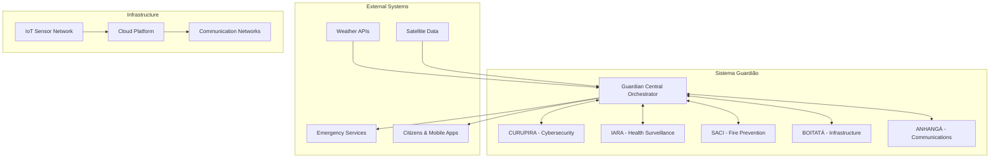
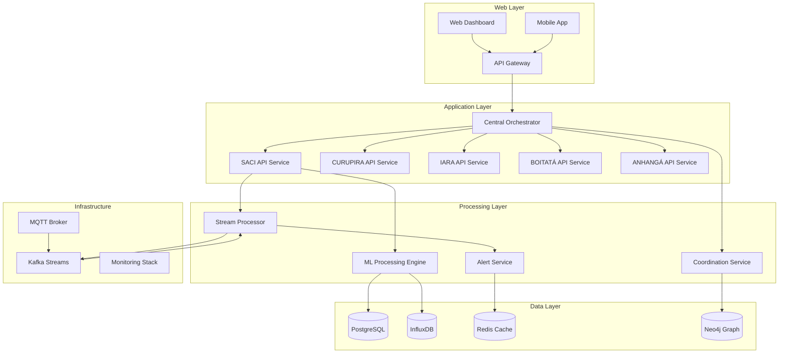
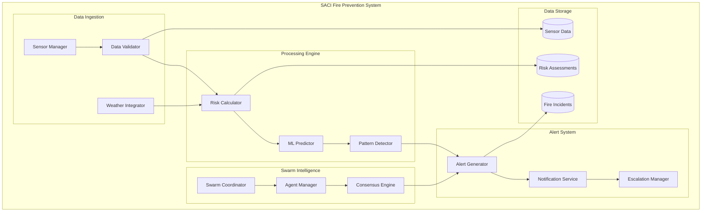
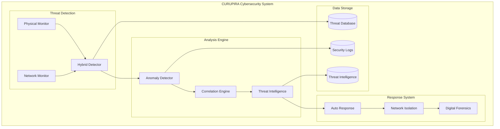
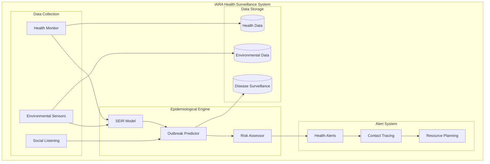
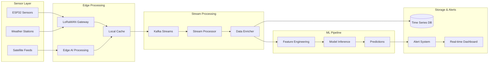
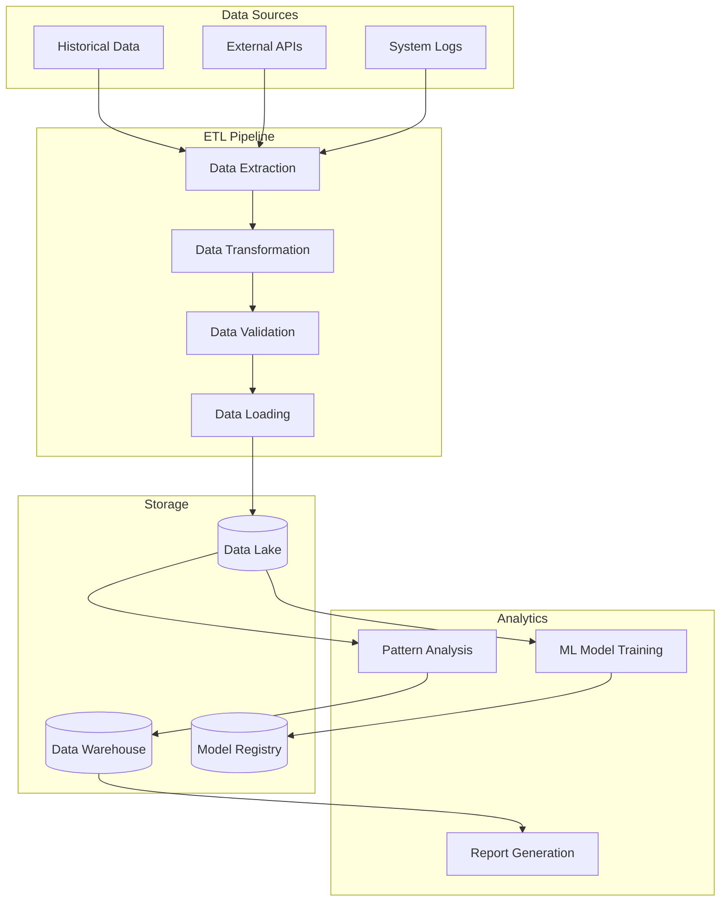
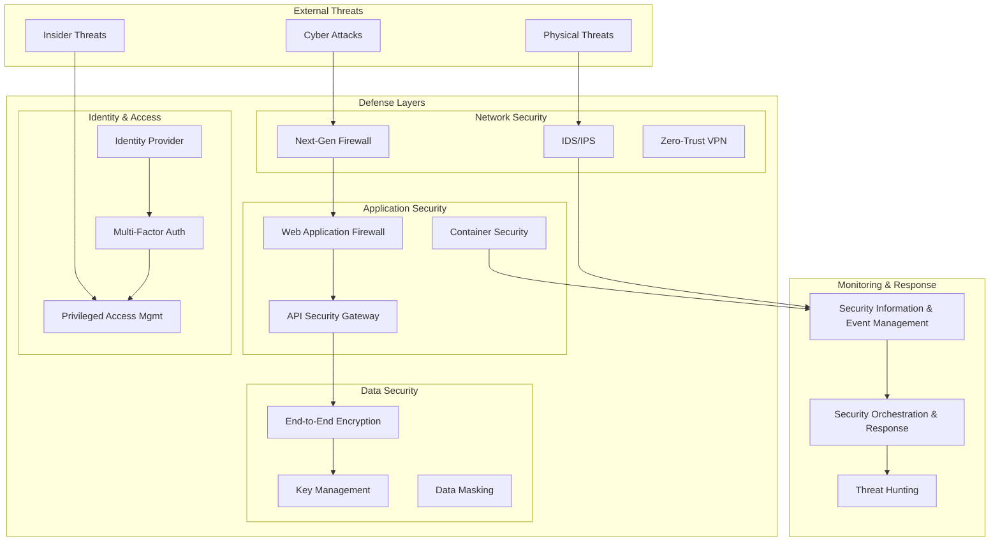
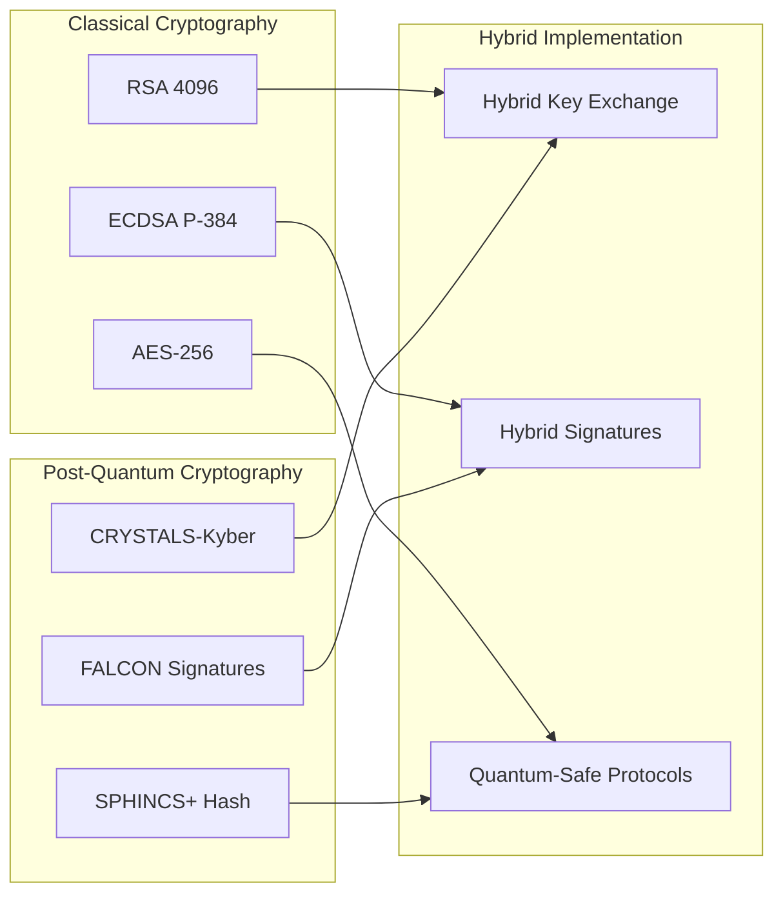
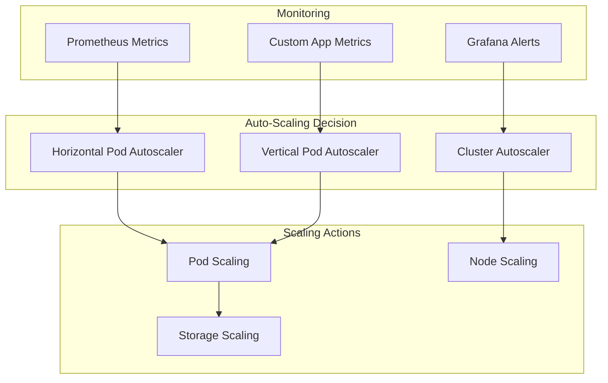

# SISTEMA GUARDIÃO - ARCHITECTURE OVERVIEW
## Complete System Architecture Specification

---

## 1. SYSTEM CONTEXT (C4 Level 1)



---

## 2. CONTAINER ARCHITECTURE (C4 Level 2)

### 2.1 Core Platform Containers


### 2.2 Technology Stack
```yaml
Frontend:
  web_dashboard: "React.js + TypeScript"
  mobile_app: "React Native"
  visualization: "D3.js + Mapbox GL"
  
API_Gateway:
  implementation: "Kong or AWS API Gateway"
  authentication: "JWT + OAuth2"
  rate_limiting: "Redis-based"
  
Backend_Services:
  api_framework: "FastAPI (Python)"
  async_processing: "Celery + Redis"
  websockets: "WebSocket support"
  
Databases:
  relational: "PostgreSQL with PostGIS"
  time_series: "InfluxDB 2.0"
  graph: "Neo4j Community"
  cache: "Redis Cluster"
  
Message_Queuing:
  streaming: "Apache Kafka"
  mqtt: "Eclipse Mosquitto"
  pub_sub: "Redis Pub/Sub"
  
ML_Platform:
  training: "scikit-learn + XGBoost"
  serving: "MLflow + FastAPI"
  pipelines: "Apache Airflow"
  
Monitoring:
  metrics: "Prometheus + Grafana"
  logging: "ELK Stack"
  tracing: "Jaeger"
  errors: "Sentry"
  
Deployment:
  containerization: "Docker + Docker Compose"
  orchestration: "Kubernetes"
  ci_cd: "GitHub Actions"
  infrastructure: "Terraform"
```

---

## 3. COMPONENT ARCHITECTURE (C4 Level 3)

### 3.1 SACI Fire Prevention Components


### 3.2 CURUPIRA Cybersecurity Components


### 3.3 IARA Health Surveillance Components


---

## 4. DATA FLOW ARCHITECTURE

### 4.1 Real-time Data Pipeline


### 4.2 Batch Processing Pipeline


---

## 5. SECURITY ARCHITECTURE

### 5.1 Zero-Trust Security Model


### 5.2 Quantum-Resistant Security


---

## 6. DEPLOYMENT ARCHITECTURE

### 6.1 Multi-Cloud Deployment
```yaml
Primary_Cloud: "AWS"
  regions:
    - "us-east-1" (N. Virginia)
    - "sa-east-1" (São Paulo)
  services:
    compute: "EKS (Kubernetes)"
    database: "RDS PostgreSQL + DocumentDB"
    storage: "S3 + EFS"
    networking: "VPC + CloudFront"
    monitoring: "CloudWatch + X-Ray"

Secondary_Cloud: "Azure"
  regions:
    - "Brazil South"
    - "East US 2"
  services:
    compute: "AKS (Kubernetes)"
    database: "Azure Database for PostgreSQL"
    storage: "Blob Storage + Azure Files"
    networking: "Virtual Network + Front Door"
    ai_ml: "Azure Machine Learning"

Edge_Computing:
  provider: "AWS IoT Greengrass"
  locations: "Regional data centers"
  capabilities:
    - "Local data processing"
    - "Offline operation"
    - "Edge AI inference"
    - "Data synchronization"

Disaster_Recovery:
  rto: "< 4 hours"
  rpo: "< 1 hour"
  strategy: "Active-Passive with automated failover"
  backup_frequency: "Continuous replication"
```

### 6.2 Kubernetes Architecture
```yaml
# kubernetes/namespace.yaml
apiVersion: v1
kind: Namespace
metadata:
  name: sistema-guardiao
  labels:
    istio-injection: enabled
---
# kubernetes/saci-deployment.yaml
apiVersion: apps/v1
kind: Deployment
metadata:
  name: saci-api
  namespace: sistema-guardiao
spec:
  replicas: 3
  selector:
    matchLabels:
      app: saci-api
  template:
    metadata:
      labels:
        app: saci-api
        version: v1
    spec:
      containers:
      - name: saci-api
        image: sistema-guardiao/saci-api:latest
        ports:
        - containerPort: 8000
        env:
        - name: DATABASE_URL
          valueFrom:
            secretKeyRef:
              name: database-secret
              key: url
        resources:
          requests:
            memory: "256Mi"
            cpu: "250m"
          limits:
            memory: "512Mi"
            cpu: "500m"
        livenessProbe:
          httpGet:
            path: /health
            port: 8000
          initialDelaySeconds: 30
          periodSeconds: 10
        readinessProbe:
          httpGet:
            path: /ready
            port: 8000
          initialDelaySeconds: 5
          periodSeconds: 5
```

---

## 7. PERFORMANCE & SCALING

### 7.1 Performance Requirements
```yaml
Response_Times:
  api_endpoints: "< 200ms (95th percentile)"
  dashboard_load: "< 2 seconds"
  alert_generation: "< 30 seconds"
  ml_inference: "< 100ms"

Throughput:
  sensor_data_ingestion: "100,000 messages/minute"
  concurrent_users: "10,000 simultaneous"
  api_requests: "50,000 requests/minute"
  database_queries: "100,000 IOPS"

Availability:
  system_uptime: "99.9% (8.76 hours downtime/year)"
  planned_maintenance: "< 2 hours/month"
  disaster_recovery: "< 4 hours RTO"
  data_backup: "< 1 hour RPO"

Scalability:
  horizontal_scaling: "Auto-scaling based on metrics"
  geographic_expansion: "Multi-region deployment"
  sensor_network: "Support 1M+ sensor nodes"
  data_retention: "5 years hot, 10 years cold"
```

### 7.2 Auto-Scaling Configuration


---

This comprehensive architecture specification provides the complete technical foundation for implementing the Sistema Guardião, ensuring scalability, security, and maintainability while supporting all five subsystems in an integrated manner.
